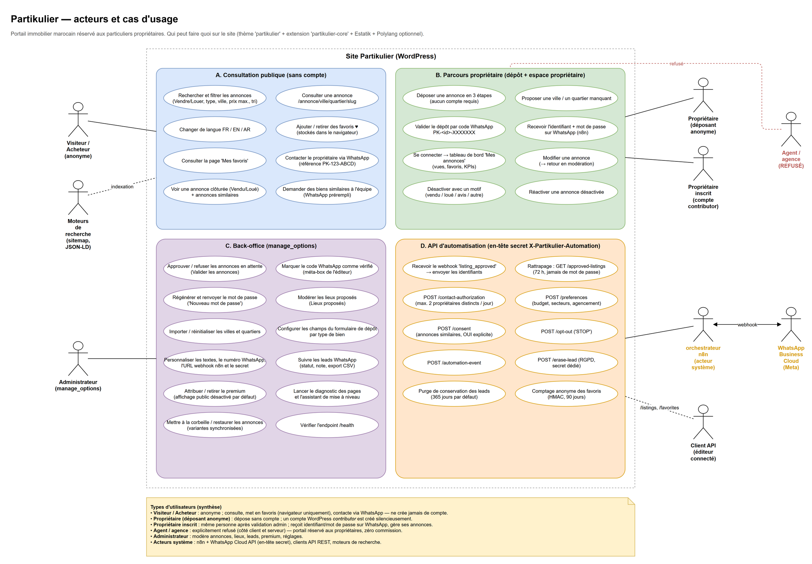
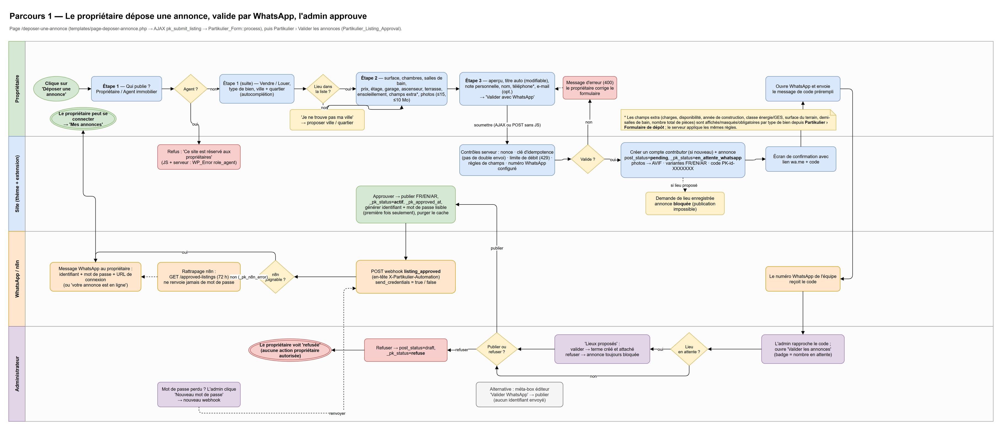
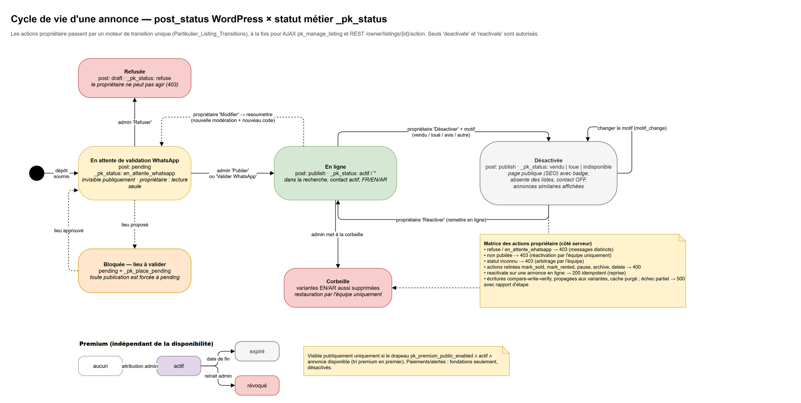
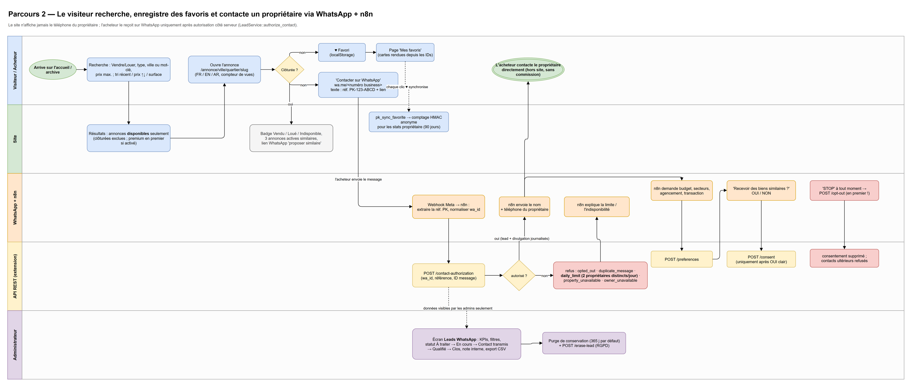
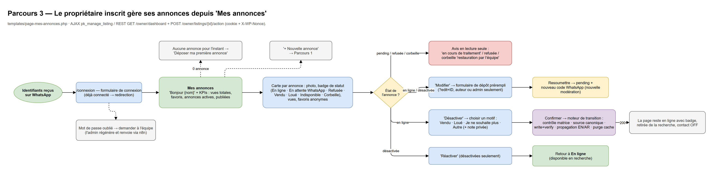
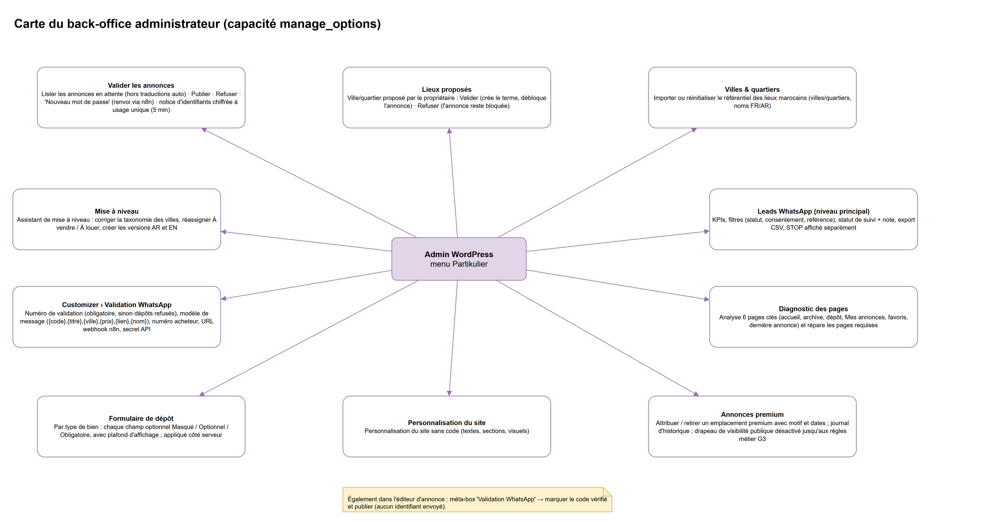
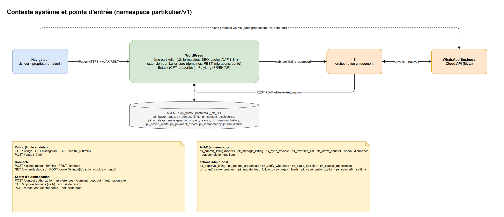

# Partikulier — types d'utilisateurs, user stories et parcours

> Versions HTML : [`user-stories.html`](user-stories/user-stories.html) et [`guide utilisateurs simple`](user-stories/guide-utilisateurs-simple.html).

> **Source de référence :** `docs/diagrams/fr/partikulier-parcours-utilisateurs.drawio`. Il contient 7 pages ; ouvrez-le dans diagrams.net / draw.io.
> Les PNG ci-dessous sont des exports de ces pages.
> **Version du code :** thème `partikulier` 6.20.7 et plugin `partikulier-core` 2.10.8.
> Version anglaise : [`USER-WORKFLOWS.md`](USER-WORKFLOWS.md).

Partikulier est un portail immobilier marocain **réservé aux propriétaires particuliers** : pas d'agents, pas de commission.

Le site repose sur :
- WordPress
- Estatik (CPT `properties` ; taxonomies `es_type`, `es_status`, `es_location`)
- Polylang (FR / EN / AR)
- le thème `partikulier` (interface, formulaire de dépôt, espace propriétaire, écrans d'administration)
- le plugin `partikulier-core` (domaines, API REST `partikulier/v1`, migrations)

WhatsApp est le canal principal pour tout : validation du compte, envoi des identifiants et contact des acheteurs. Il est orchestré par **n8n** via l'API WhatsApp Business Cloud.



---

## 1. Types d'utilisateurs

| # | Type | Identité WordPress | Interactions | Code principal |
|---|------|--------------------|--------------|----------------|
| 1 | **Visiteur / acheteur** | Anonyme (n'a jamais de compte) | Parcourt, filtre et trie les annonces ; change de langue ; garde ses favoris dans le navigateur ; contacte un propriétaire **uniquement via WhatsApp** | `archive-properties.php`, `single-properties.php`, `class-search-filters.php`, `class-favorites*.php` |
| 2 | **Propriétaire – déposant anonyme** | Aucune, puis un compte *contributor* créé de façon transparente | Remplit le formulaire de dépôt en 3 étapes, puis envoie un code de validation sur WhatsApp | `page-deposer-annonce.php`, `class-form.php` (`pk_submit_listing`, nopriv) |
| 3 | **Propriétaire inscrit** | `contributor`, auteur de ses annonces | Se connecte sur `/connexion` et gère ses annonces sur `/mes-annonces` (modifier, désactiver avec motif, réactiver, indicateurs) | `page-mes-annonces.php`, `class-listing-transitions.php`, REST `/owner/*` |
| 4 | **Agent / agence** (refusé) | Jamais créé | Choisir « Agent immobilier » bloque le formulaire côté navigateur ; le serveur renvoie `WP_Error role_agent` (`agent`, `mandataire`, `agence`) | `class-form.php` |
| 5 | **Administrateur** | `manage_options` | Modère les annonces et les lieux proposés, configure le site, suit les leads WhatsApp, attribue le premium, lance les diagnostics | `class-listing-approval.php`, `class-place-requests.php`, `class-admin-*.php`, `Domain/Leads` |
| 6 | **n8n (acteur système)** | Secret partagé, en-tête `X-Partikulier-Automation` | Reçoit le webhook `listing_approved`, envoie les identifiants et appelle les endpoints leads (autorisation, préférences, consentement, désinscription) | `RestController.php`, `LeadsContactTrait.php` |
| 7 | **WhatsApp Business Cloud (Meta)** | Externe | Achemine les messages des propriétaires et des acheteurs vers et depuis n8n | — |
| 8 | **Client de l'API REST** | Utilisateur connecté (cookie + `X-WP-Nonce`) | `GET/POST /listings`, `POST /favorites`, `/owner/dashboard` | `RouteRegistry.php` |
| 9 | **Moteurs de recherche** | Anonyme | Explorent les URL canoniques `/annonce/ville/quartier/slug/`, le sitemap et le JSON-LD ; les anciennes URL sont redirigées en 301 | `class-seo*.php`, `class-permalinks.php` |

---

## 2. User stories

### Visiteur / acheteur

- En tant que visiteur, **je veux** filtrer par *Vendre/Louer*, type de bien, ville ou mot-clé et prix maximum, et trier par date, prix ↑↓ ou surface, **afin de** trouver un bien qui me convient.
- En tant que visiteur, **je veux** ne voir que les annonces *disponibles* dans les résultats, **afin de** ne pas perdre de temps avec des biens vendus ou loués. Les annonces premium passent en tête uniquement si l'option publique est activée.
- En tant que visiteur, **je veux** lire une annonce en FR, EN ou AR, **afin de** la comprendre dans ma langue.
- En tant que visiteur, **je veux** ajouter des annonces à mes favoris sans compte et les retrouver sur « Mes favoris », **afin de** les comparer plus tard.
  - Les favoris sont stockés dans le localStorage.
  - Chaque ♥ envoie aussi un comptage anonyme (HMAC) pour les statistiques du propriétaire, conservé 90 jours.
- En tant que visiteur, **je veux** cliquer sur « Contacter sur WhatsApp », **afin de** joindre le propriétaire sans que son numéro soit publié sur le site.
  - Un message `wa.me` vers le numéro professionnel est prérempli avec la référence `PK-<id>-XXXX`.
- En tant que visiteur arrivant sur une annonce vendue, louée ou indisponible, **je veux** voir un badge clair, 3 annonces similaires et un lien WhatsApp « proposer des biens similaires », **afin de** poursuivre ma recherche.
- En tant qu'acheteur sur WhatsApp, **je veux** indiquer mon budget, mes quartiers et la configuration souhaitée, accepter ou refuser les suggestions similaires par un « OUI » explicite, et tout arrêter avec « STOP ».

### Propriétaire (déposant)

- En tant que propriétaire, **je veux** publier une annonce **sans créer de compte**, en 3 étapes :
  1. Rôle, Vendre/Louer, type, ville et quartier.
  2. Détails, plus jusqu'à 15 photos de 10 Mo maximum chacune, converties en AVIF.
  3. Aperçu, titre automatique, nom, téléphone et e-mail facultatif.
- En tant que propriétaire, **je veux** proposer une ville ou un quartier manquant, **afin de** ne pas être bloqué. L'annonce reste non publiée tant que l'administrateur n'a pas validé le lieu.
- En tant que propriétaire, **je veux** confirmer mon dépôt en envoyant le code `PK-<id>-XXXXXXX` sur WhatsApp en un clic, **afin que** l'équipe sache que le numéro est réel.
- En tant que propriétaire, **je veux** recevoir mon identifiant, mon mot de passe et l'URL de connexion sur WhatsApp une fois l'annonce en ligne.
- En tant que propriétaire, **je veux** un message d'erreur clair si je soumets deux fois par erreur, si j'atteins la limite de requêtes (429) ou si un champ est invalide.

### Propriétaire inscrit

- En tant que propriétaire, **je veux** voir le statut, les vues et le nombre de favoris de chaque annonce, ainsi que des indicateurs globaux, sur « Mes annonces ».
- En tant que propriétaire, **je veux** modifier une annonce (`?edit=ID`), sachant qu'elle repasse en modération avec un nouveau code WhatsApp.
- En tant que propriétaire, **je veux** désactiver une annonce en indiquant un motif : *Vendu*, *Loué*, *Je ne souhaite plus* ou *Autre* (avec une note privée).
  - La page reste publique avec un badge.
  - L'annonce sort des résultats de recherche et le bouton de contact est désactivé.
- En tant que propriétaire, **je veux** réactiver une annonce désactivée.
- En tant que propriétaire, **je ne peux pas** annuler une décision de l'administrateur (*refusée*, *en attente WhatsApp*) ni utiliser les actions retirées. Le moteur de transitions renvoie 403 ou 400.

### Agent / agence

- En tant qu'agent, **je suis refusé** avec le message « Ce site est réservé aux propriétaires ». La règle est appliquée en JS et côté serveur.

### Administrateur

- En tant qu'administrateur, **je veux** voir les annonces en attente, le compteur (badge) et le code WhatsApp à rapprocher.
  - Je peux **Publier** (variantes FR/EN/AR ensemble) ou **Refuser**.
- En tant qu'administrateur, **je veux** que les identifiants soient générés et envoyés une seule fois.
  - **« Nouveau mot de passe »** régénère le mot de passe et le renvoie.
- En tant qu'administrateur, **je veux** valider ou rejeter les lieux proposés avant que les annonces qui les utilisent puissent être mises en ligne.
- En tant qu'administrateur, **je veux** importer ou réinitialiser les villes et quartiers, et configurer les champs du formulaire de dépôt par type de bien (*Masqué / Optionnel / Obligatoire*).
- En tant qu'administrateur, **je veux** personnaliser :
  - les textes
  - le numéro WhatsApp de validation et son modèle de message (`{code} {titre} {ville} {prix} {lien} {nom}`)
  - le numéro WhatsApp acheteurs
  - l'URL du webhook n8n et son secret
- En tant qu'administrateur, **je veux** suivre les leads WhatsApp :
  - statuts *À traiter → En cours → Contact transmis → Qualifié → Clos*
  - note interne et export CSV
  - conservation de 365 jours et effacement RGPD
- En tant qu'administrateur, **je veux** attribuer ou retirer le premium. Il n'est visible du public que si l'option globale est activée.
- En tant qu'administrateur, **je veux** lancer le diagnostic des pages et l'assistant de mise à niveau.

---

## 3. Parcours

### 3.1 Dépôt → validation WhatsApp → approbation



1. **Contrôles serveur :** nonce, clé d'idempotence, limite de requêtes, règles des champs et numéro WhatsApp configuré. Sans ce numéro, les dépôts sont refusés.
2. **En cas de succès :**
   - Un compte *contributor* est créé.
   - L'annonce passe en `post_status=pending` et `_pk_status=en_attente_whatsapp`.
   - Les photos sont converties en AVIF.
   - Les variantes FR/EN/AR et le code sont créés.
3. **Propriétaire → équipe :** le propriétaire envoie le code via `wa.me`.
4. **Décision de l'administrateur :**
   - Si un lieu est en attente, il doit d'abord être modéré. `guard_publication` maintient l'annonce en attente jusque-là.
   - **Publier** passe l'annonce en `publish`, `_pk_status=actif` et `_pk_approved_at`, crée le mot de passe la première fois uniquement, envoie le webhook `listing_approved` à n8n (`send_credentials` true/false) et purge le cache.
   - **Refuser** passe l'annonce en `draft` et `_pk_status=refuse`.
5. **Si n8n est injoignable :** `_pk_n8n_error` est renseigné, et n8n rattrape plus tard via `GET /approved-listings` (72 dernières heures ; ne renvoie jamais de mot de passe).
6. **Voie alternative :** la meta box de l'éditeur « Valider WhatsApp » publie sans envoyer d'identifiants.

### 3.2 Cycle de vie d'une annonce



**Statuts :** `en_attente_whatsapp` → `actif` | `refuse` ; `actif` ⇄ `vendu` / `loue` / `indisponible`.

**Actions du propriétaire :** seules `deactivate` et `reactivate` sont autorisées.
- Les actions retirées (`mark_sold`, `mark_rented`, `pause`, `archive`, `delete`) renvoient **400**.
- Les marqueurs administrateur et les annonces non publiées renvoient **403**.

**Écriture d'un changement :** comparaison-écriture-vérification, puis propagation aux variantes linguistiques, puis purge du cache.

**Corbeille :** mettre une annonce à la corbeille y place aussi ses variantes.

### 3.3 Parcours acheteur et contact WhatsApp



1. **Recherche → annonce → contact :** l'acheteur trouve une annonce et écrit au numéro professionnel via `wa.me`.
2. **Webhook Meta → n8n :** n8n reçoit le message.
3. **`POST /contact-authorization` :** renvoie **allowed**, ou l'un de ces refus :
   - `opted_out`
   - `duplicate_message`
   - `daily_limit` (2 propriétaires distincts par jour)
   - `property_unavailable`
   - `owner_unavailable`
4. **Si autorisé :** n8n transmet le nom et le téléphone du propriétaire, et la divulgation est journalisée.
5. **Qualification :** `/preferences` (budget, quartiers, configuration), puis `/consent`, uniquement après un OUI explicite.
6. **Désinscription :** « STOP » appelle immédiatement `/opt-out`.
7. **Suivi administrateur :** l'administrateur suit le lead dans **Leads WhatsApp**.

### 3.4 Espace propriétaire



### 3.5 Back-office administrateur



### 3.6 Carte système et API



**Endpoints publics :**
- `GET /listings`, `/listings/{id}`, `/health` (180/min)
- `POST /leads` (10/min)

**Endpoints connectés :**
- `POST /listings` (éditeur, 30/min)
- `POST /favorites`
- `GET /owner/dashboard`
- `POST /owner/listings/{id}/action`

**Endpoints avec secret d'automatisation :**
- `/contact-authorization`, `/preferences`, `/consent`, `/opt-out`, `/automation-event`, `/approved-listings`
- `/erase-lead` utilise son propre secret dédié.

**Pas encore actif :** le paiement en ligne et les alertes de recherche enregistrées existent dans le code comme fondations, mais sont **désactivés**.

---

## 4. Modifier les diagrammes

1. Ouvrez `docs/diagrams/fr/partikulier-parcours-utilisateurs.drawio` dans diagrams.net (web ou bureau).
2. Réexportez une page avec :

   ```
   draw.io -x -f png -s 1.5 -b 20 -p <page> -o docs/diagrams/fr/<nom>.png docs/diagrams/fr/partikulier-parcours-utilisateurs.drawio
   ```
