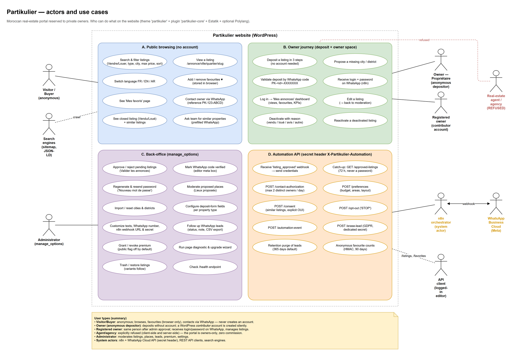
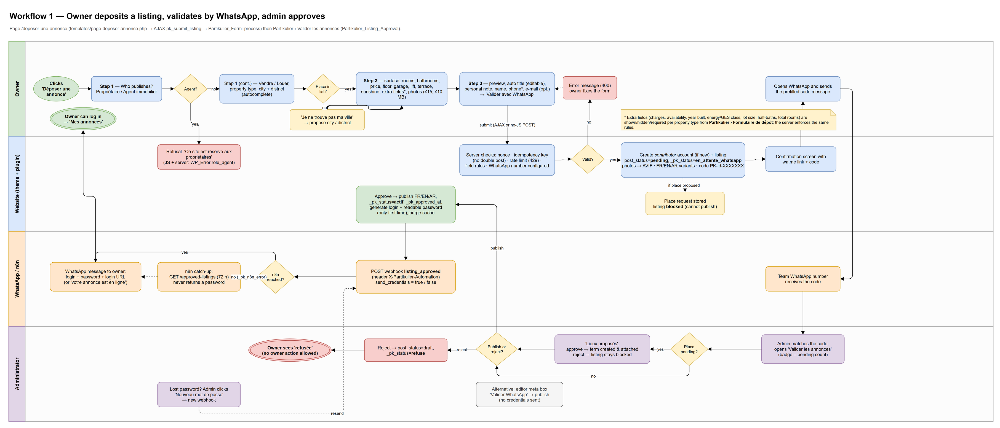
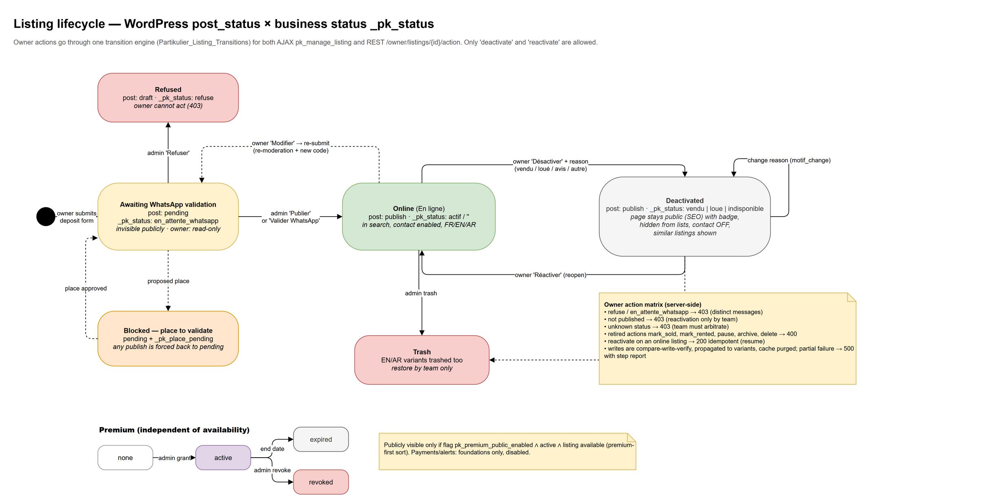
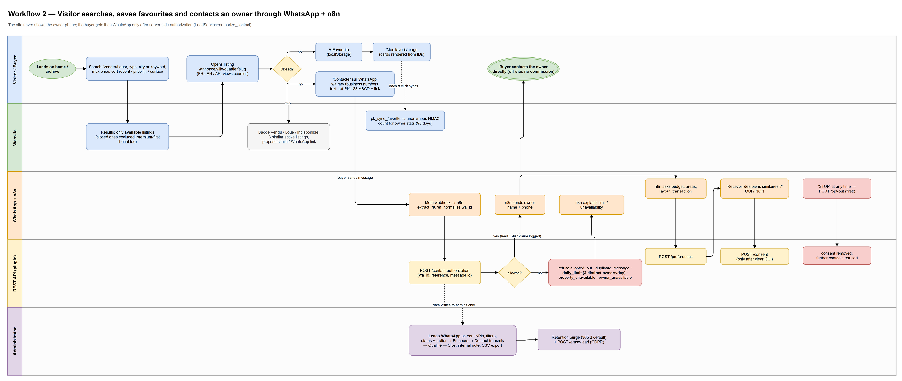
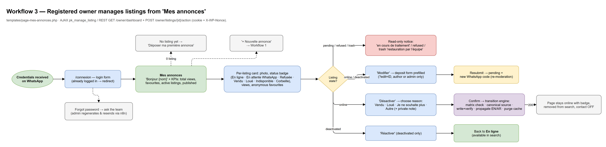
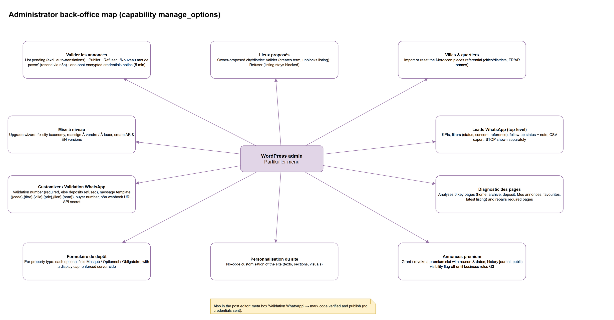
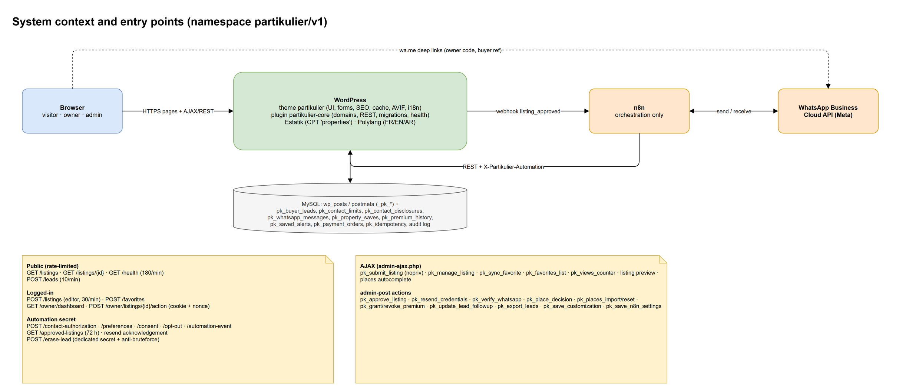

# Partikulier — user types, user stories and workflows

> Designed HTML versions: [`user-stories.html`](user-stories/user-stories.html) and [`simple user guide`](user-stories/guide-utilisateurs-simple.html).

> **Source of truth:** `docs/diagrams/partikulier-user-workflows.drawio`. It has 7 pages; open it in diagrams.net / draw.io.
> The PNGs below are exports of those pages.
> **Code version:** theme `partikulier` 6.20.7 and plugin `partikulier-core` 2.10.8.
> French version: [`PARCOURS-UTILISATEURS.md`](PARCOURS-UTILISATEURS.md).

Partikulier is a Moroccan real-estate portal **reserved to private owners**: no agents and no commission.

The site is built from:
- WordPress
- Estatik (CPT `properties`; taxonomies `es_type`, `es_status`, `es_location`)
- Polylang (FR / EN / AR)
- the `partikulier` theme (UI, deposit form, owner space, admin screens)
- the `partikulier-core` plugin (domains, REST API `partikulier/v1`, migrations)

WhatsApp is the main channel for everything: account validation, credentials and buyer contact. It is orchestrated by **n8n** through the WhatsApp Business Cloud API.



---

## 1. User types

| # | Type | WordPress identity | How they interact | Main code |
|---|------|--------------------|-------------------|-----------|
| 1 | **Visitor / buyer** | Anonymous (never has an account) | Browses, filters and sorts listings; switches language; keeps favourites in the browser; contacts an owner **through WhatsApp only** | `archive-properties.php`, `single-properties.php`, `class-search-filters.php`, `class-favorites*.php` |
| 2 | **Owner – anonymous depositor** | None, then a *contributor* account created silently | Fills the 3-step deposit form, then sends a validation code on WhatsApp | `page-deposer-annonce.php`, `class-form.php` (`pk_submit_listing`, nopriv) |
| 3 | **Registered owner** | `contributor`, author of the listings | Logs in at `/connexion` and manages listings at `/mes-annonces` (edit, deactivate with a reason, reactivate, KPIs) | `page-mes-annonces.php`, `class-listing-transitions.php`, REST `/owner/*` |
| 4 | **Agent / agency** (refused) | Never created | Choosing "Agent immobilier" blocks the form on the client side; the server returns `WP_Error role_agent` (`agent`, `mandataire`, `agence`) | `class-form.php` |
| 5 | **Administrator** | `manage_options` | Moderates listings and proposed places, configures the site, follows WhatsApp leads, grants premium, runs diagnostics | `class-listing-approval.php`, `class-place-requests.php`, `class-admin-*.php`, `Domain/Leads` |
| 6 | **n8n (system actor)** | Shared secret, header `X-Partikulier-Automation` | Receives the `listing_approved` webhook, sends credentials, and calls the lead endpoints (authorization, preferences, consent, opt-out) | `RestController.php`, `LeadsContactTrait.php` |
| 7 | **WhatsApp Business Cloud (Meta)** | External | Carries owner and buyer messages to and from n8n | — |
| 8 | **REST API client** | Logged-in user (cookie + `X-WP-Nonce`) | `GET/POST /listings`, `POST /favorites`, `/owner/dashboard` | `RouteRegistry.php` |
| 9 | **Search engines** | Anonymous | Crawl the canonical URLs `/annonce/ville/quartier/slug/`, the sitemap and JSON-LD; old URLs get a 301 redirect | `class-seo*.php`, `class-permalinks.php` |

---

## 2. User stories

### Visitor / buyer

- As a visitor, **I want to** filter by *Vendre/Louer*, property type, city or keyword, and maximum price, and sort by recent, price ↑↓ or surface, **so that** I can find a property that fits me.
- As a visitor, **I want to** see only *available* listings in results, **so that** I don't waste time on sold or rented ones. Premium listings come first only when the public flag is on.
- As a visitor, **I want to** read a listing in FR, EN or AR, **so that** I understand it in my language.
- As a visitor, **I want to** add listings to my favourites without an account and see them on "Mes favoris", **so that** I can compare them later.
  - Favourites are stored in localStorage.
  - Each ♥ also sends an anonymous HMAC count for owner statistics, kept for 90 days.
- As a visitor, **I want to** press "Contacter sur WhatsApp", **so that** I can reach the owner without the phone number being published on the site.
  - A `wa.me` message to the business number is prefilled with reference `PK-<id>-XXXX`.
- As a visitor arriving on a sold, rented or unavailable listing, **I want to** see a clear badge, 3 similar listings and a "propose similar" WhatsApp link, **so that** I can keep searching.
- As a buyer on WhatsApp, **I want to** state my budget, areas and layout, accept or refuse similar suggestions with an explicit "OUI", and stop everything with "STOP".

### Owner (depositor)

- As an owner, **I want to** publish a listing **without creating an account** in 3 steps:
  1. Role, Vendre/Louer, type, city and district.
  2. Details, plus up to 15 photos of 10 MB maximum each, converted to AVIF.
  3. Preview, auto title, name, phone, and optional e-mail.
- As an owner, **I want to** propose a city or district that is missing, **so that** I am not blocked. The listing stays unpublished until the admin approves the place.
- As an owner, **I want to** confirm my deposit by sending the `PK-<id>-XXXXXXX` code on WhatsApp in one tap, **so that** the team knows the number is real.
- As an owner, **I want to** receive my login, password and login URL on WhatsApp once the listing is online.
- As an owner, **I want to** get a clear error message when I resubmit by mistake, hit the rate limit (429), or leave an invalid field.

### Registered owner

- As an owner, **I want to** see each listing's status, views and favourite count, plus global KPIs, on "Mes annonces".
- As an owner, **I want to** edit a listing (`?edit=ID`), knowing that it goes back to moderation with a new WhatsApp code.
- As an owner, **I want to** deactivate a listing and give a reason: *Vendu*, *Loué*, *Je ne souhaite plus* or *Autre* (with a private note).
  - The page stays public with a badge.
  - The listing leaves search results and the contact button is turned off.
- As an owner, **I want to** reactivate a deactivated listing.
- As an owner, **I cannot** override admin decisions such as *refusée* or *en attente WhatsApp*, and I cannot use retired actions. The transition engine returns 403 or 400.

### Agent / agency

- As an agent, **I am refused** with the message "Ce site est réservé aux propriétaires". This is enforced in JS and on the server.

### Administrator

- As an admin, **I want to** see the pending listings, the badge count, and the WhatsApp code to match.
  - I can **Publier** (FR/EN/AR variants together) or **Refuser**.
- As an admin, **I want** credentials to be generated and sent only once.
  - **"Nouveau mot de passe"** regenerates the password and sends it again.
- As an admin, **I want to** approve or reject proposed places before the listings that use them can go online.
- As an admin, **I want to** import or reset cities and districts, and configure the deposit form fields per property type (*Masqué / Optionnel / Obligatoire*).
- As an admin, **I want to** customise:
  - texts
  - the validation WhatsApp number and its message template (`{code} {titre} {ville} {prix} {lien} {nom}`)
  - the buyer WhatsApp number
  - the n8n webhook URL and secret
- As an admin, **I want to** follow WhatsApp leads:
  - statuses *À traiter → En cours → Contact transmis → Qualifié → Clos*
  - internal note and CSV export
  - retention of 365 days, and GDPR erase
- As an admin, **I want to** grant or revoke premium. It is visible to the public only when the global flag is on.
- As an admin, **I want to** run a diagnostic of the pages and the upgrade wizard.

---

## 3. Workflows

### 3.1 Deposit → WhatsApp validation → approval



1. **Server checks:** nonce, idempotency key, rate limit, field rules, and a configured WhatsApp number. Without that number, deposits are refused.
2. **On success:**
   - A *contributor* account is created.
   - The listing is set to `post_status=pending` and `_pk_status=en_attente_whatsapp`.
   - Photos are converted to AVIF.
   - FR/EN/AR variants and the code are created.
3. **Owner → team:** the owner sends the code via `wa.me`.
4. **Admin decision:**
   - If a place is pending, it must be moderated first. `guard_publication` keeps the listing in pending until then.
   - **Publier** sets `publish`, `_pk_status=actif` and `_pk_approved_at`, creates the password the first time only, sends the `listing_approved` webhook to n8n (`send_credentials` true/false), and purges the cache.
   - **Refuser** sets `draft` and `_pk_status=refuse`.
5. **If n8n is unreachable:** `_pk_n8n_error` is set, and n8n catches up later with `GET /approved-listings` (last 72 h; it never returns a password).
6. **Alternative path:** the editor meta box "Valider WhatsApp" publishes without sending credentials.

### 3.2 Listing lifecycle



**Statuses:** `en_attente_whatsapp` → `actif` | `refuse`; `actif` ⇄ `vendu` / `loue` / `indisponible`.

**Owner actions:** only `deactivate` and `reactivate` are allowed.
- Retired actions (`mark_sold`, `mark_rented`, `pause`, `archive`, `delete`) return **400**.
- Admin markers and unpublished listings return **403**.

**How a change is written:** compare-write-verify, then propagation to the language variants, then a cache purge.

**Trash:** trashing a listing also trashes its variants.

### 3.3 Buyer journey and WhatsApp contact



1. **Search → listing → contact:** the buyer finds a listing and messages the business number via `wa.me`.
2. **Meta webhook → n8n:** n8n receives the message.
3. **`POST /contact-authorization`:** returns **allowed**, or one of these refusals:
   - `opted_out`
   - `duplicate_message`
   - `daily_limit` (2 distinct owners per day)
   - `property_unavailable`
   - `owner_unavailable`
4. **If allowed:** n8n sends the owner's name and phone, and the disclosure is logged.
5. **Qualification:** `/preferences` (budget, areas, layout), then `/consent`, only after an explicit OUI.
6. **Opt-out:** "STOP" calls `/opt-out` immediately.
7. **Admin follow-up:** the admin tracks the lead in **Leads WhatsApp**.

### 3.4 Owner space



### 3.5 Administrator back-office



### 3.6 System and API map



**Public endpoints:**
- `GET /listings`, `/listings/{id}`, `/health` (180/min)
- `POST /leads` (10/min)

**Logged-in endpoints:**
- `POST /listings` (editor, 30/min)
- `POST /favorites`
- `GET /owner/dashboard`
- `POST /owner/listings/{id}/action`

**Automation secret endpoints:**
- `/contact-authorization`, `/preferences`, `/consent`, `/opt-out`, `/automation-event`, `/approved-listings`
- `/erase-lead` uses its own dedicated secret.

**Not active yet:** online payments and saved search alerts exist as foundations in the code, but they are **disabled**.

---

## 4. Editing the diagrams

1. Open `docs/diagrams/partikulier-user-workflows.drawio` in diagrams.net (web or desktop).
2. Re-export a page with:

   ```
   draw.io -x -f png -s 1.5 -b 20 -p <page> -o docs/diagrams/<name>.png docs/diagrams/partikulier-user-workflows.drawio
   ```
